# AF3 One‑Zip Analyzer

Interactive tool to analyze **AlphaFold 3** ZIP exports (one ZIP at a time), compute **close contacts** between two chains, optionally run **PDBe Arpeggio** to classify interactions, and generate **plots** + **Residue Interaction Network (RIN)** images. Works whether your ZIP has a single AF3 run or multiple run folders.

---

## What this is

AlphaFold 3 typically gives you a ZIP with one or more “run” folders containing CIFs like:

- `fold_<name>_model_0.cif` … `fold_<name>_model_4.cif`

This tool lets you:

- Pick a ZIP from a **menu** (or use a file dialog).
- Inspect **chain stats** from the first model so you can confidently map chains.
- Choose **interaction type**: *Peptide–Protein*, *Protein–Protein*, or *Ligand–Receptor*.
- Accept sensible defaults (e.g., smaller chain → peptide) or **rename groups**.
- Compute **close contacts**; optionally run **PDBe Arpeggio** to type interactions.
- Produce per‑model **plots** + **RIN** images and a per‑run **summary CSV**.

All outputs are written **next to the CIFs** inside the extracted ZIP tree.

---

## Quick tour (single‑run example)

Menu →  
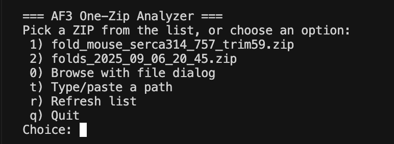

Chain stats (from the first model) →  
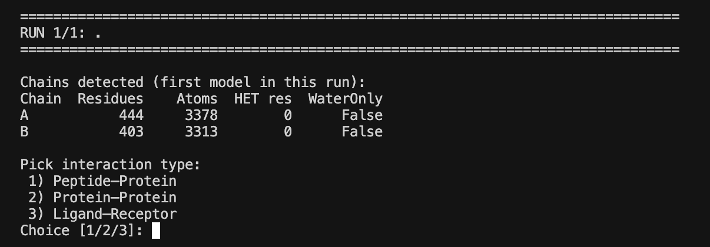

Map chains & name groups →  
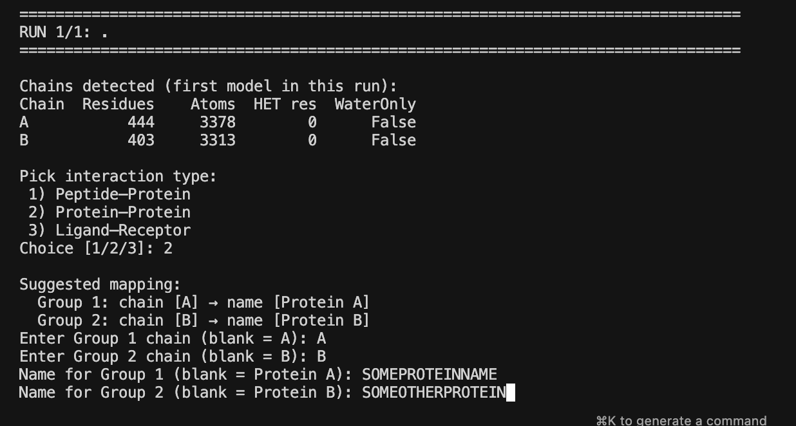

Final confirmation →  
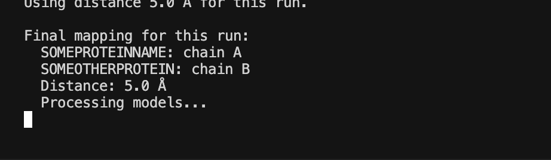

Outputs include:

- **RIN** (interaction‑colored graph)  
  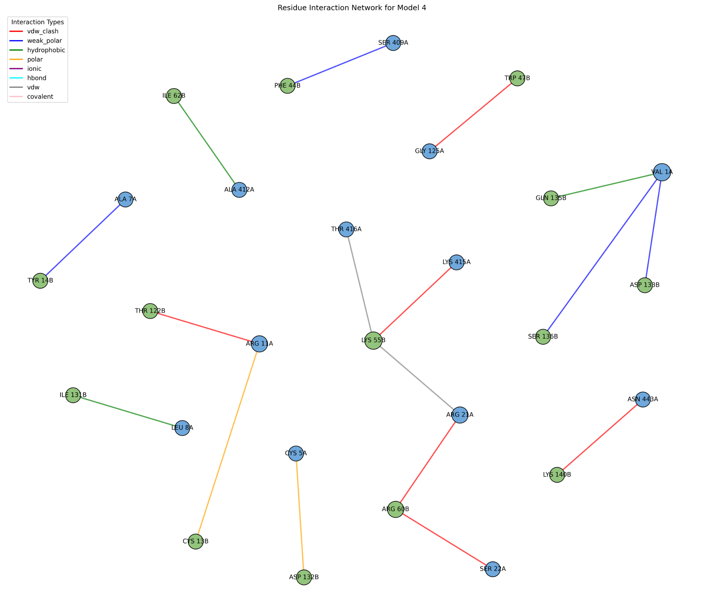
- **Close‑contact counts per group**  
  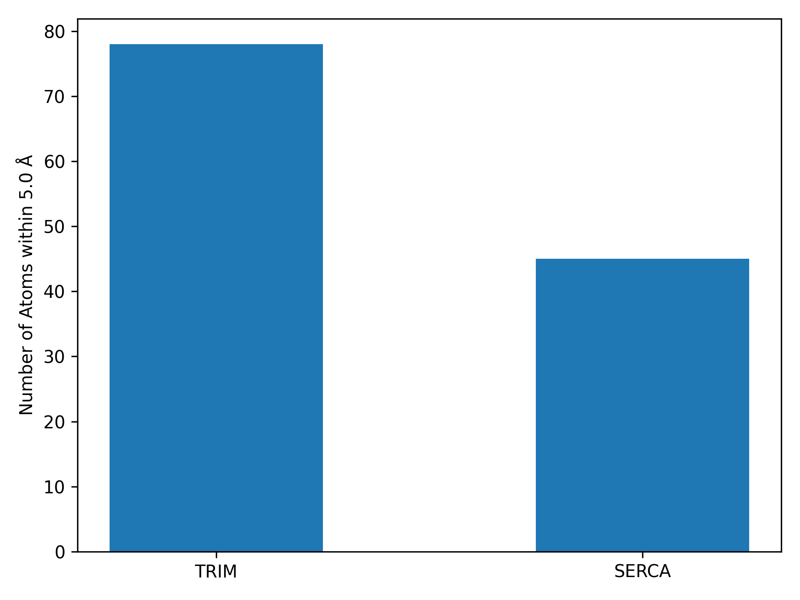

---

## Quick tour (multi‑run ZIP)

Menu with multiple ZIPs →  
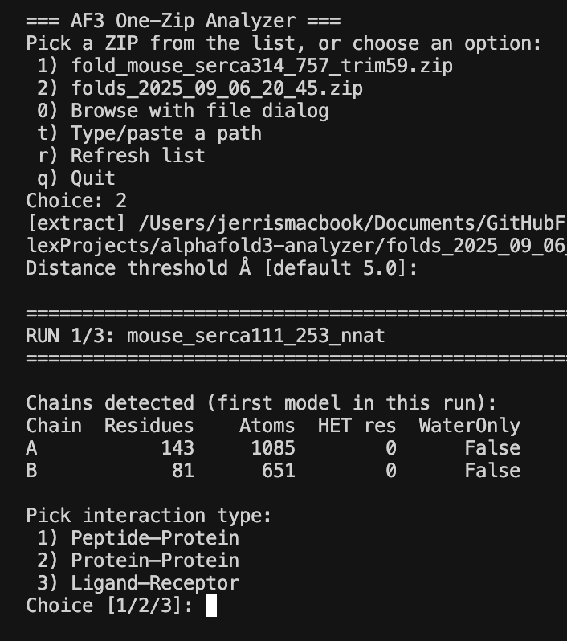

Run 1: chain stats →  
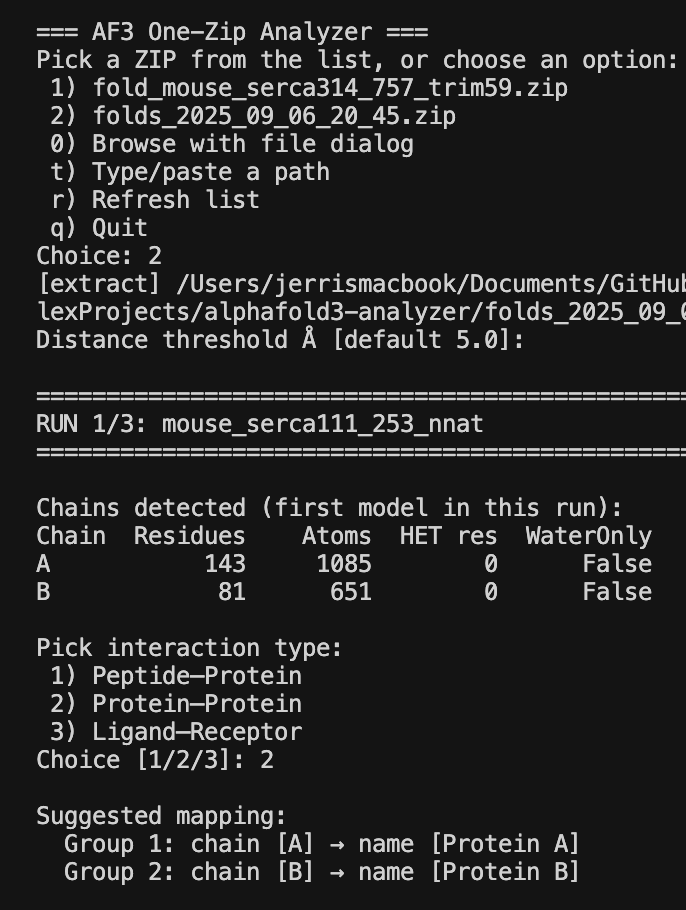

Run 1: mapping →  
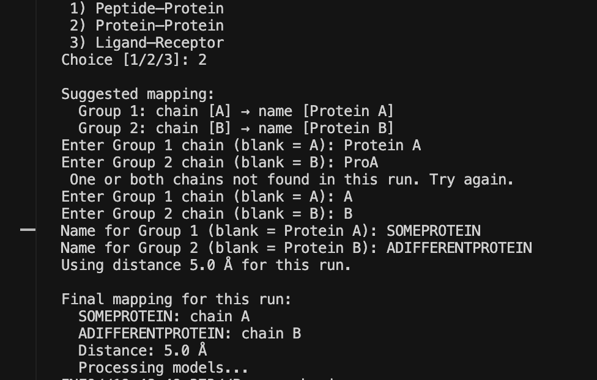

Run 1: final →  
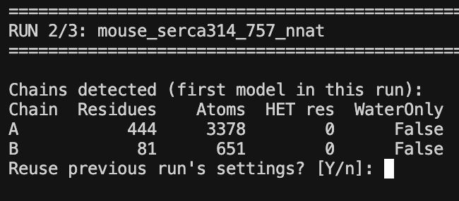

Run 2: reuse previous run’s settings if appropriate →  
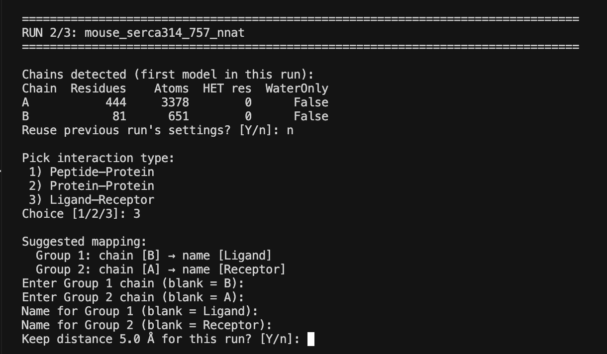

Run 2: mapping (adjust if needed) →  
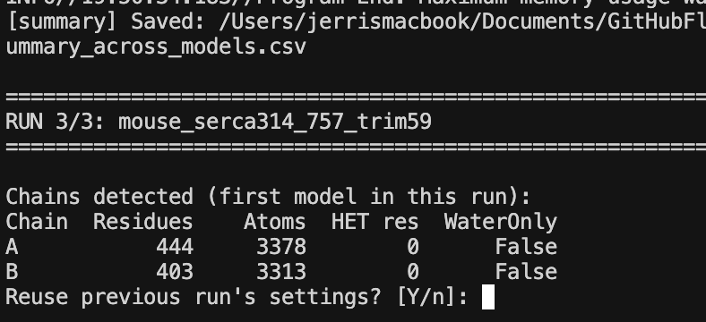

---

## Repo contents

Keep these in the repo root:

- `Analysis_Script.py` — the menu‑driven analyzer
- `Classes.py` — Atom parser used by the analyzer
- `assets/` — screenshots used by this README (filenames referenced above)

Optional examples for demos:

- `fold_mouse_serca314_757_trim59.zip` — single‑run example
- `folds_2025_09_06_20_45.zip` — multi‑run example

---

## Install

### Option A — conda/mamba (recommended)

```bash
conda install -y -n base -c conda-forge mamba
mamba env create -y -f environment.yml
conda activate af3-arpeggio
```

### Option B — pip/venv (no conda)

```bash
python -m venv .venv
source .venv/bin/activate  # Windows: .venv\Scripts\activate
pip install --upgrade pip
pip install -r requirements.txt
```

> **Note (Open Babel):** the pip wheel `openbabel-wheel` is not available on macOS. On macOS use conda (`environment.yml`) or Homebrew (`brew install open-babel`). Arpeggio will run once Open Babel is available on the system.

---

## Run your first analysis

```bash
python Analysis_Script.py
```

You’ll see:

```
=== AF3 One-Zip Analyzer ===
 1) your_first.zip
 2) your_second.zip
 0) Browse with file dialog
 t) Type/paste a path
 r) Refresh list
 q) Quit
```

Pick a ZIP, then follow the prompts per run:

- Choose interaction type (Peptide–Protein, Protein–Protein, Ligand–Receptor).
- Review chain stats; accept or edit the suggested mapping.
- Rename groups if you like (e.g., SERCA / TRIM).
- Confirm the distance threshold (default **5.0 Å**).
- For later runs, you can **reuse** previous settings if chains match.

---

## Outputs (per CIF / per run)

For each model `fold_<name>_model_N.cif`:
- `fold_<name>_model_N.pdb` — CIF → PDB (fast parsing)
- `fold_<name>_model_N_close_contacts.pdb` — atoms within cutoff between the two selected chains
- `fold_<name>_model_N_close_contacts.cif` — CIF version of the close‑contacts PDB
- `fold_<name>_model_N_contact_plot.png` — per‑group unique close‑contact atom counts
- `Residue_Interaction_Network_Model_<N>.png` — RIN colored by interaction type (if typing available)

If **PDBe Arpeggio** is installed:
- `*_close_contacts.json` — interaction annotations
- `*_close_contacts.csv` — CSV converted by the script

**Run‑level summary:**
- `interaction_summary_across_models.csv` — interaction types per residue pair across models

**Where files go:** the ZIP is extracted to `./<zip_basename>/`. Each run folder holds its own outputs.

---

## Requirements (recap)

Minimum (without typing): Python 3.10–3.11, biopython, gemmi, numpy, pandas, matplotlib, networkx, tk.  
Optional (for interaction typing): Open Babel + PDBe Arpeggio.

**Why Python 3.11?** Open Babel packages often trail the newest Python releases; 3.13 may not have wheels on your OS yet.

---

## Reproducible environments

- **Shareable:** keep the curated `environment.yml` (portable, not over‑pinned).
- **Exact clone of your workstation** (same OS/arch):
  ```bash
  conda env export --no-builds > environment.exported.yml
  conda env export --from-history > environment.from-history.yml
  ```

---

## Troubleshooting

- `ModuleNotFoundError: openbabel` — install Open Babel via conda‑forge or Homebrew; or comment out the `run_arpeggio(...)` call to skip typing.
- Arpeggio CLI not found — `pip install -q pdbe-arpeggio`.
- Large complexes are slow — distance search is O(N×M); swap in a KD‑Tree (`scipy.spatial.cKDTree`) for speed.
- macOS “archive is empty” — confirm you created a standard ZIP.  
  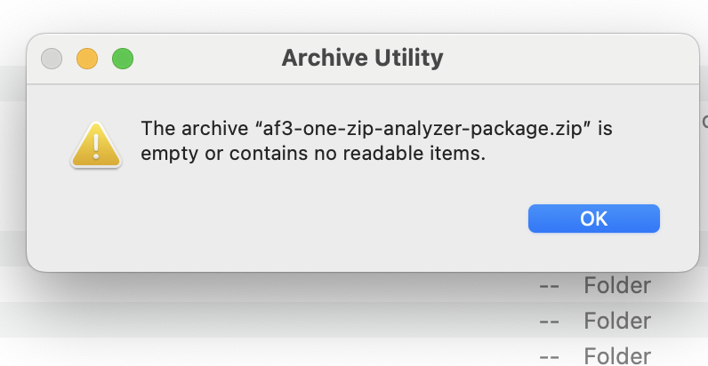
